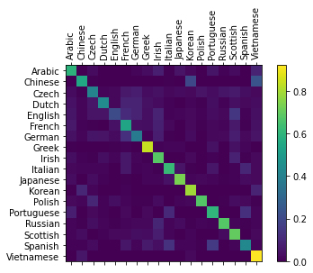

# ex1 : 성[First Name]을 보고 출신 국가 예측하는 RNN 모델  

### Goal

Pytorch 기반의 RNN 모델링 실습을 통한 공부

### Refs: 

https://tutorials.pytorch.kr/intermediate/char_rnn_classification_tutorial.html

### Output: 

  
  
