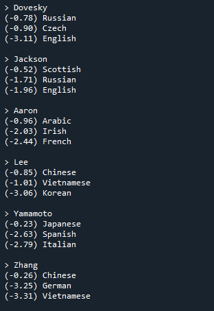

# ex1 : 성[First Name]을 보고 출신 국가 예측하는 RNN 모델  


### Goal

Pytorch 기반의 RNN 모델링 실습을 통한 공부


### Refs: 
기초부터 시작하는 NLP: 문자-단위 RNN으로 이름 분류하기  
Author: Sean Robertson  
번역: 황성수  
단어를 분류하기 위해 기초적인 문자-단위 RNN을 구축하고 학습 할 예정입니다. 이 튜토리얼에서는 (이후 2개 튜토리얼과 함께) NLP 모델링을 위한 데이터 전처리를 torchtext 의 편리한 많은 기능들을 사용하지 않고 어떻게 하는지 “기초부터(from scratch)” 보여주기 떄문에 NLP 모델링을 위한 전처리가 저수준에서 어떻게 진행되는지를 알 수 있습니다. 문자-단위 RNN은 단어를 문자의 연속으로 읽어 들여서 각 단계의 예측과 “은닉 상태(Hidden State)” 출력하고, 다음 단계에 이전 은닉 상태를 전달합니다. 단어가 속한 클래스로 출력이 되도록 최종 예측으로 선택합니다.
   
구체적으로, 18개 언어로 된 수천 개의 성(姓)을 훈련시키고, 철자에 따라 이름이 어떤 언어인지 예측합니다:   
```python
$ python predict.py Hinton
(-0.47) Scottish
(-1.52) English
(-3.57) Irish

$ python predict.py Schmidhuber
(-0.19) German
(-2.48) Czech
(-2.68) Dutch
```   
https://tutorials.pytorch.kr/intermediate/char_rnn_classification_tutorial.html


### Output: 

  
  

### Report:   
**주축에서 벗어난 밝은 점을 선택하여 잘못 추측한 언어를 표시 할 수 있습니다. 예를 들어 한국어는 중국어로 이탈리아어로 스페인어로. 그리스어는 매우 잘되는 것으로 영어는 매우 나쁜것으로 보입니다. (다른 언어들과 중첩 때문으로 추정)**
