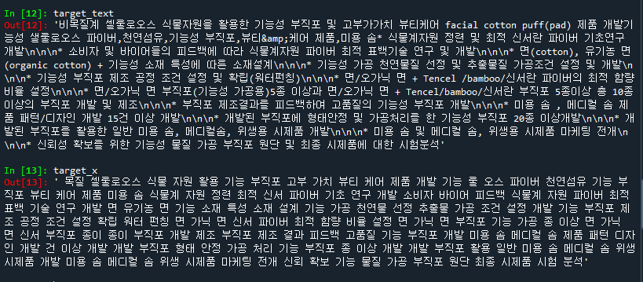

## Natural Language-based Climate Technology Classification Project by KNU-BrainAI


--- 


## Pre-Processing 

- 12 Train columns 중 4가지 '과제명', '요약문_한글키워드', '요약문_연구목표', 'label' 사용 
- **Mecab Tokenizer**를 통해 형태소 단위 분절 후 **Nouns: 명사형태만 추출하는 방식**을 최종 적용




## Models 

**Single Models**  
|Filename|Model|Pretrain Detail|Val Score|Test Score|
|------|------|---|---|---|
|**Model1**|BERT-base-Multilingual-cased|multi-lingual based|0.65|0.64|
|**Model2**|BERT-base-Multilingual-uncased|multi-lingual based|0.71|0.68|
|**Model3**|KLUE-BERT-base|Korean based|0.74|0.72|
|**Model4**|SKT/KoBERT|Korean based|0.67|0.67|
|**Model5**|RoBERTa-base|Only English based|0.59|0.57|
|**Model6**|KLUE-RoBERTa-base|Korean based|0.72|0.70|
|**Model7**|XLM-RoBERTa-base|Cross-lingual & multi-lingual based|0.63|0.61|


**not yet**

|**Model8**|KoELECTRA-base|Fixed-Parameter|---|---|  
|**Model9**|KLUE-RoBERTa-Large|Fixed-Parameter|---|---|  
|**Model10**|TBD|Fixed-Parameter|---|---|    


***uncased**: it does not make a difference between english and English.  

<!--
**Ensemble Models**  
|Filename|Model|설명|F1 스코어|
|------|------|---|---|
|**앙상블 Model1**|?|Fixed-Parameter|---|
|**앙상블 Model2**|?|Fixed-Parameter|---|
-->

## Hyperparameters (Fixed)

```(python)
NUM_EPOCHS = 10
VALID_SPLIT = 0.2
MAX_LEN=96

optimizer = tf.keras.optimizers.Adam(3e-5)
loss = tf.keras.losses.SparseCategoricalCrossentropy(from_logits=True)
metric = tf.keras.metrics.SparseCategoricalAccuracy('accuracy')
```


